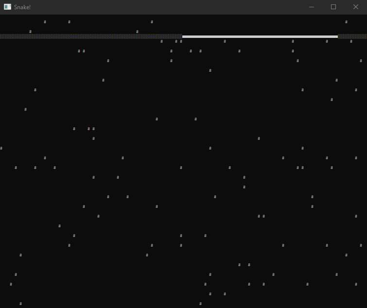

# snake
`Snake` game, writing in `Assembler` works in `Windows`



# Dependecies
* [nasm](https://www.nasm.us/)
* [GoLink](http://www.godevtool.com/GolinkFrame.htm)

# Start

### Build game
``` console
> PATH_TO_NASM -f win64 console_win32_snake.asm -o console_win32_snake.obj
```

### Link
``` console
> PATH_TO_GOLINK /entry:start /console kernel32.dll user32.dll console_win32_snake.obj
```

### Or use `.bat` file in repo and change path for `nasm` and `GoLink`

``` bat
@echo off

@REM path to NASM + some flags
SET NASM=..\nasm -O3
@REM path to golink
SET GOLINK=..\golink

%NASM% -f win64 console_win32_snake.asm -o console_win32_snake.obj
%GOLINK% /entry:start /console kernel32.dll user32.dll console_win32_snake.obj

pause
exit
```

# Controls

`→`, `←`, `↑`, `↓` - move snake.